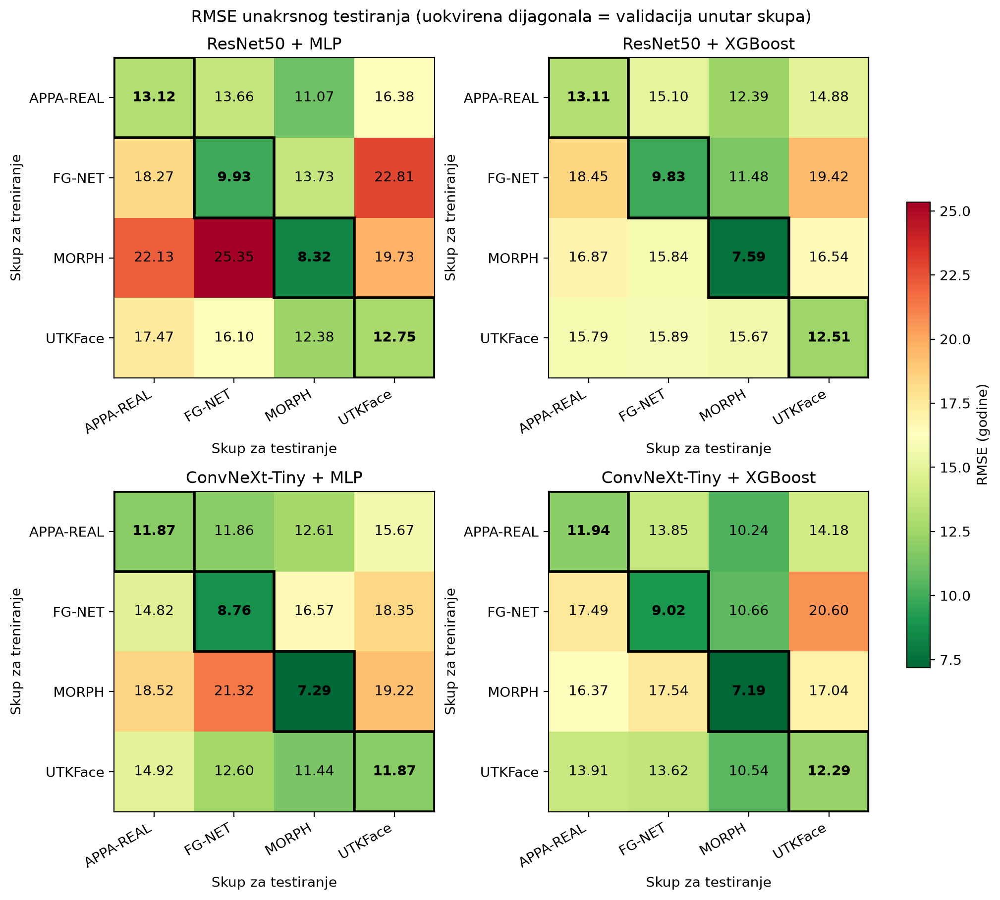
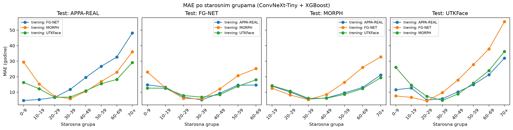

# Procena godina na osnovu slike lica: evaluacija unakrsnim testiranjem

Završni rad: evaluacija modela za procenu godina čoveka na osnovu slike lica,
sa naglaskom na **unakrsno testiranje između skupova podataka** (*cross-dataset evaluation*).

## Pristup

Koristi se **transferno učenje sa ekstrakcijom karakteristika**: pretrenirane konvolucione
mreže (zamrznute težine) pretvaraju sliku lica u vektor karakteristika, a godine predviđaju
klasični algoritmi mašinskog učenja.

```
slika lica ──► detekcija i poravnanje ──► CNN (bez poslednjeg sloja) ──► vektor karakteristika
                   (YuNet, 224×224)        ResNet50 / ConvNeXt-Tiny          │
                                                                              ▼
                                         procenjene godine ◄── StandardScaler → PCA → MLP / XGBoost
```

Svaki model se trenira na jednom skupu podataka, a evaluira na **svim ostalim skupovima zasebno**.

| Komponenta | Varijante |
|---|---|
| CNN za ekstrakciju | `resnet50.tv2_in1k`, `convnext_tiny.fb_in1k` (timm, ImageNet-1k) |
| ML algoritam | MLP (`scikit-learn`), XGBoost |
| Skupovi podataka | APPA-REAL, FG-NET, MORPH II, UTKFace |
| Ukupno modela | 2 CNN × 2 ML × 4 skupa = **16** |
| Unakrsnih evaluacija | 16 modela × 3 test skupa = **48** |

## Skupovi podataka

| Skup | Slika | Osoba | Godine | Izvor oznaka |
|---|---|---|---|---|
| APPA-REAL | 7.591 | — | 1–100 | `labels.csv` |
| FG-NET | 1.002 | 82 | 0–69 | ime fajla (`001A02.JPG`) |
| MORPH II | 50.015 | 19.033 | 16–77 | ime fajla (`00013_00M19.JPG`) |
| UTKFace | 23.705 | — | 1–116 | `.parquet` (Hugging Face) |

Skupovi podataka **nisu deo repozitorijuma** zbog veličine i licenci. Treba ih preuzeti
sa zvaničnih izvora i smestiti u sledeću strukturu:

```
data/raw/
├── appa/
│   ├── labels.csv            # kolone: file_name, real_age
│   └── final_files/*.jpg
├── fgnet/
│   └── images/*.JPG
├── morph/
│   └── Dataset/Images/{Train,Validation,Test}/*.JPG
└── utkface/
    └── train-0000X-of-00003.parquet
```

## Struktura repozitorijuma

```
├── src/
│   ├── datasets.py          # učitavanje skupova u zajednički format
│   ├── preprocess.py        # detekcija, poravnanje i isecanje lica
│   ├── extract_features.py  # ekstrakcija karakteristika (ResNet50, ConvNeXt)
│   ├── train.py             # optimizacija hiperparametara i treniranje
│   ├── evaluate.py          # unakrsno testiranje (MAE, RMSE, CS(5))
│   ├── plots.py             # grafici
│   ├── summary.py           # pregled glavnih rezultata
│   └── predict.py           # procena godina za sopstvene slike
├── models/
│   └── face_detection_yunet_2023mar.onnx   # detektor lica (OpenCV Zoo)
├── results/
│   ├── hpo/                 # najbolji hiperparametri, CV MAE i CV RMSE (.json)
│   ├── cross_dataset.csv    # svi rezultati unakrsnog testiranja
│   └── figures/             # grafici
└── requirements.txt
```

Folderi `data/`, `features/` i `results/models/` se prave tokom izvršavanja i nisu na Git-u.

## Instalacija

Python 3.13, Windows (Git Bash):

```bash
python -m venv .venv
source .venv/Scripts/activate
pip install -r requirements.txt
```

Na Linux-u / macOS-u: `source .venv/bin/activate`.

## Pokretanje

Sve komande se pokreću iz korena projekta. Navedena vremena su izmerena na procesoru
(12 niti, bez GPU-a).

| Korak | Komanda | Izlaz | Vreme |
|---|---|---|---|
| 1. Učitavanje skupova | `python -m src.datasets` | `data/metadata.csv` | ~1 min |
| 2. Predobrada lica | `python -m src.preprocess` | `data/processed/`, `data/metadata_processed.csv` | ~1,2 h |
| 3. Ekstrakcija karakteristika | `python -m src.extract_features --model resnet50`<br>`python -m src.extract_features --model convnext` | `features/<model>/<skup>.npy` | ~2,3 h + ~2 h |
| 4. Optimizacija i treniranje | `python -m src.train` | `results/models/`, `results/hpo/` | ~1,5 h |
| 5. Unakrsno testiranje | `python -m src.evaluate` | `results/cross_dataset.csv` | ~2 min* |
| 6. Grafici | `python -m src.plots` | `results/figures/` | ~2 min |
| 7. Pregled rezultata | `python -m src.summary` | ispis u terminalu | nekoliko sekundi |

\* Prvo pokretanje traje nekoliko minuta duže, jer se za validaciju unutar skupa
jednom računa RMSE i upisuje u `results/hpo/*.json`.

Koraci 2–4 podržavaju nastavak posle prekida: već završeni delovi se preskaču.
Korisne opcije:

```bash
python -m src.preprocess --limit 20                                            # proba na 20 slika po skupu
python -m src.extract_features --model resnet50 --datasets fgnet --limit 256   # merenje brzine
python -m src.train --cnn convnext --ml xgboost --train morph --trials 25      # jedna kombinacija
```

## Procena godina za sopstvene slike

Skripta `predict.py` provodi nove slike kroz isti postupak kao slike iz skupova
(predobrada → ekstrakcija → predviđanje) i prikazuje procene sva četiri modela,
po jedan za svaki skup za treniranje.

```bash
python -m src.predict data/moje_slike                  # sve slike u folderu
python -m src.predict data/moje_slike/slika.jpg        # jedna slika
python -m src.predict a.jpg b.jpg --cnn resnet50 --ml mlp
```

Ako ime fajla završava stvarnim godinama (npr. `ime_26.jpg`), za svaki model se
računaju greška, MAE i RMSE. Greška se računa **posebno za svaki model**, jer su
modeli trenirani na različitim skupovima i predstavljaju odvojene eksperimente.

Poravnata lica i tabela procena čuvaju se u `data/`, koji nije na Git-u.

## Metodologija

**Predobrada.** Detektor lica YuNet (OpenCV, prag 0,6) pronalazi lice i 5 karakterističnih
tačaka. Lice se poravnava transformacijom sličnosti (rotacija, ravnomerno skaliranje i
pomeranje) tako da se tačke poklope sa ArcFace šablonom (faktor kadra 0,9), a zatim seče
na 224×224 piksela; ivice se popunjavaju refleksijom. Slike bez detektovanog lica
(73 od 82.313) se izostavljaju.

**Ekstrakcija.** Mreže su pretrenirane na ImageNet-1k, sa uklonjenim klasifikacionim
slojem. Izlaz je vektor od 2048 (ResNet50) ili 768 (ConvNeXt-Tiny) karakteristika.

**Optimizacija hiperparametara.** Posebno za svaku od 16 kombinacija:
- Optuna (TPE), 25 proba, kriterijum je **MAE**;
- `GroupKFold` sa 3 folda **po osobi**, tako da ista osoba nije i u treningu i u validaciji;
- podskup do 5.000 slika, biranih po osobama; konačan model se trenira na celom skupu;
- broj PCA komponenti (128 / 256 / 512) je takođe hiperparametar.

**Metrike.**

| Metrika | Opis |
|---|---|
| MAE | srednja apsolutna greška, u godinama |
| RMSE | koren srednje kvadratne greške, u godinama; jače kažnjava velike promašaje |
| CS(5) | procenat slika sa greškom ≤ 5 godina |
| Osnovna linija | MAE modela koji uvek predviđa prosečne godine iz skupa za treniranje |
| Poboljšanje | `(1 − MAE / MAE_osnovne_linije) × 100%` |

Hiperparametri su birani prema MAE, a RMSE je prijavljen kao dodatna metrika.
Uvek važi RMSE ≥ MAE; veća razlika znači češće velike greške.

Radi ponovljivosti rezultata, početna vrednost generatora pseudoslučajnih brojeva
(*seed*) postavljena je na 42 u svim koracima.

## Rezultati

Prosek preko 4 skupa (unutar skupa) i preko 12 unakrsnih parova (između skupova):

| CNN + ML | MAE unutar | MAE između | RMSE unutar | RMSE između | CS(5) | Poboljšanje | Gore od osnovne linije |
|---|---|---|---|---|---|---|---|
| ResNet50 + MLP | 8,21 | 13,61 | 11,03 | 17,42 | 25,4% | 11,1% | 3 / 12 |
| ResNet50 + XGBoost | 8,16 | 12,50 | 10,76 | 15,69 | 25,0% | 15,9% | 2 / 12 |
| ConvNeXt-Tiny + MLP | 7,56 | 12,50 | 9,95 | 15,66 | 25,7% | 17,1% | 4 / 12 |
| **ConvNeXt-Tiny + XGBoost** | **7,61** | **11,58** | **10,11** | **14,67** | **27,9%** | **24,2%** | **0 / 12** |






### Glavni zaključci

1. Unakrsno testiranje povećava MAE za 4,0–5,4 godine (52–66%), a RMSE za 4,6–6,4 godine (45–58%) u odnosu na validaciju unutar skupa.
2. ConvNeXt-Tiny daje bolje karakteristike od ResNet50 i bolje generalizuje na skupove
   sa drugačijim karakteristikama slika.
3. MLP i XGBoost su izjednačeni unutar skupa, ali XGBoost bolje generalizuje.
4. Raznovrsnost i pokrivenost godina u skupu za treniranje su bitniji od broja slika:
   APPA-REAL i UTKFace generalizuju najbolje, a MORPH, iako najveći, najlošije.
5. Greške su najveće za uzraste koji nisu zastupljeni u skupu za treniranje (deca, stariji).

Odnos RMSE / MAE je između 1,25 i 1,34 za sve kombinacije, blizu vrednosti za normalno
raspodeljene greške (≈ 1,25), što znači da modeli ne prave povremene ekstremne promašaje,
nego ravnomerno veće greške na nepoznatim skupovima.